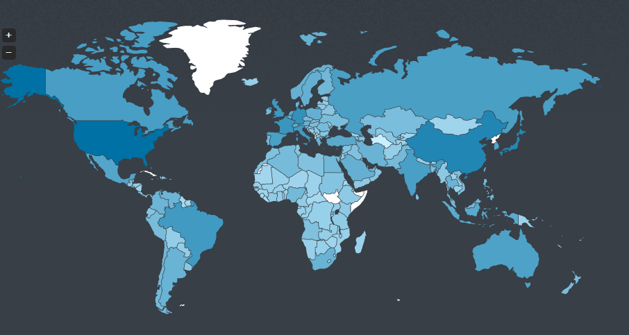
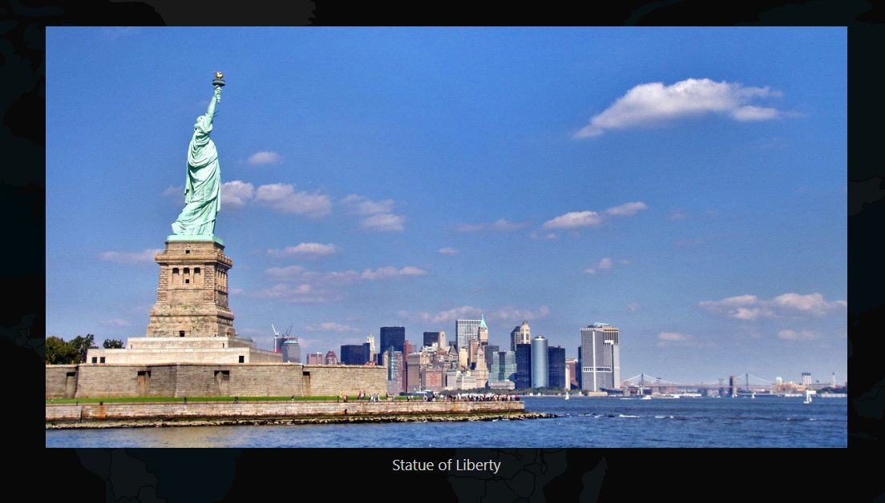
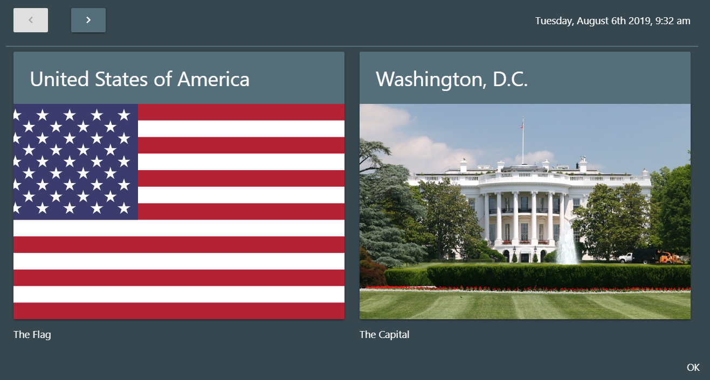
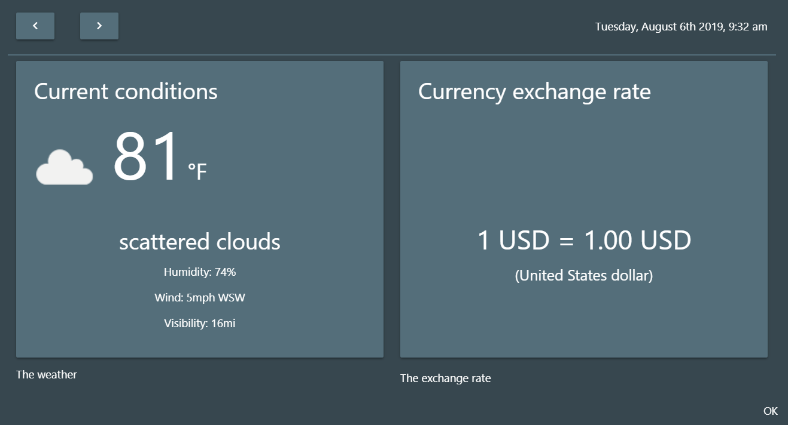
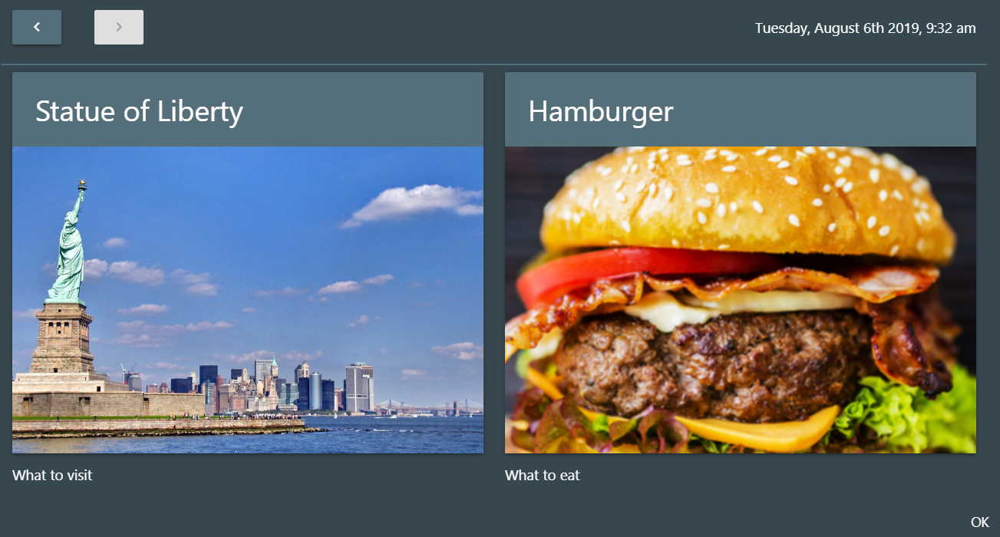

# Where-In-The-World
Interactive World Map

## Description:
Where in the world is an interactive World Map created to assist travelers with important country information. Each country clicked will activate a modal with the country flag, current weather, current local time, national food dish, and currency exchange rate.

## Visuals
   

## Resources
API:

http://jvectormap.com/ [BACKGROUND MAP]

https://restcountries.eu/ [CAPITAL, FLAG IMAGE, LATITUDE & LONGITUDE, CURRENCY CODE]

https://currency-exchange.p.rapidapi.com/exchange [CURRENCY RATE API]

https://rapidapi.com/community/api/open-weather-map [WEATHER CONDITIONS]

REAL-TIME DATABASE:

https://firebase.google.com [ATTRACTION CAPITAL, NAME & IMAGE]

Framework:

https://materializecss.com/modals.html [Grid & Modal]

JSON:

[Object that contains dish name and image]

Moment JS:

[Time Formatting]
 

## Contributing
Pull requests are welcome. For major changes, please open an issue first to discuss what you would like to change.

Please make sure to update tests as appropriate.

## Authors and acknowledgment
Fawzi Alami

Justin Lockridge

Nicole Hendricks

Wikipedia (for data on countries and capitals)

Google search (for finding attractions of cities and food pictures)

## License
License Copyright: Copyright © 2007 Free Software Foundation, Inc.
License License: "Everyone is permitted to copy and distribute verbatim copies of this license document, but changing it is not allowed." (www.gnu.org/licenses/gpl-3.0.en.html).
License Contact: Free Software Foundation (fsf.org).
SPDX short identifier: GPL-3.0-only

